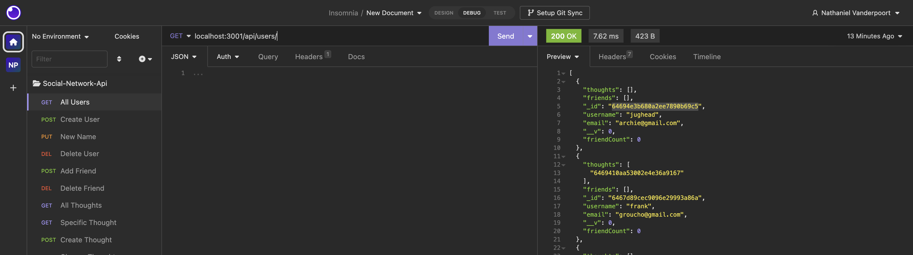
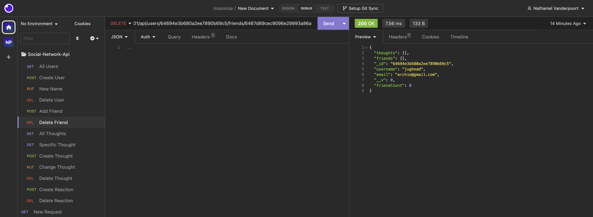
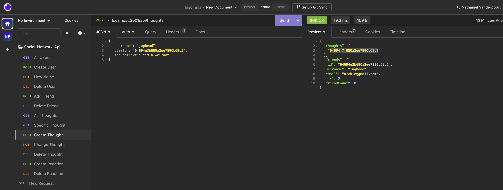

# Nathaniel-NoSQL-Social-Network-API
## Description
#
This soical network API allows users to add friends, create thoughts, and react to other another user's thoughts. Considering the application is only the backend - it uses a NOSQL database, the Mongoose ODM to take in the unstructured data, Express.js for routing, and a MongoDB database. This can hypothetically be used to connect to a simple social media app's front end.

## Installation 
#
This app was created using javascript and these npm packages: express and mongoose.
## Usage
#
Once the user types in NPM start, the application launches. From here, the user can usec can use Insomnia to navigate all of the Mongoose models. This is where the user can use the GET, POST, PUT, and Delete routes to add/delete/update users, friends, and thoughts. 

## Credits
#
Credit goes to UCI for providing the guidelines for this assignment. 

## License
#
N/A
## Deployment/Video 
(https://drive.google.com/file/d/15wZnrvMLNvweMLo_6XPUOJstBYLlAZ7p/view?usp=sharing)

